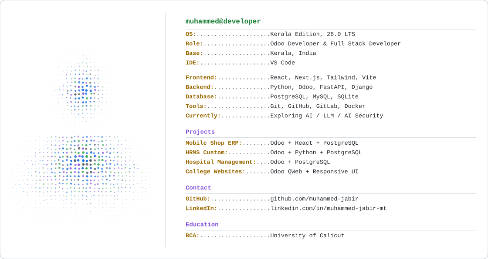

<picture>
  <source media="(prefers-color-scheme: dark)" srcset="./dark_mode.svg">
  
</picture>

<picture>
  <source media="(prefers-color-scheme: dark)" srcset="https://github-readme-stats.vercel.app/api?username=muhammed-jabir&show_icons=true&theme=github_dark&hide_border=true&count_private=true">
  
</picture>

<picture>
  <source media="(prefers-color-scheme: dark)" srcset="https://github-readme-streak-stats.herokuapp.com/?user=muhammed-jabir&theme=github-dark-blue&hide_border=true">
  
</picture>
